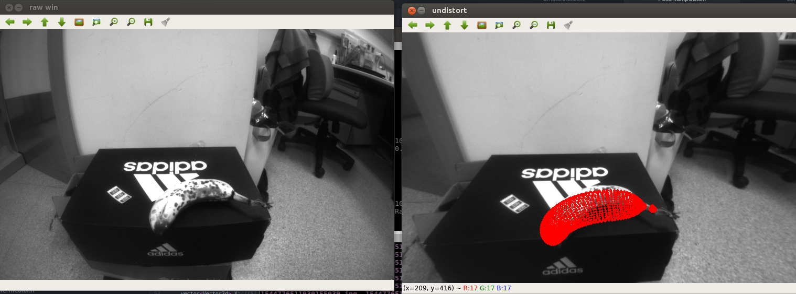
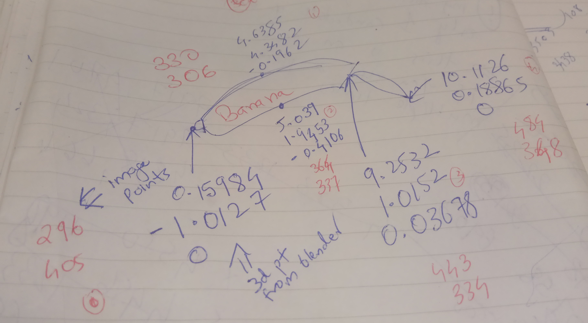
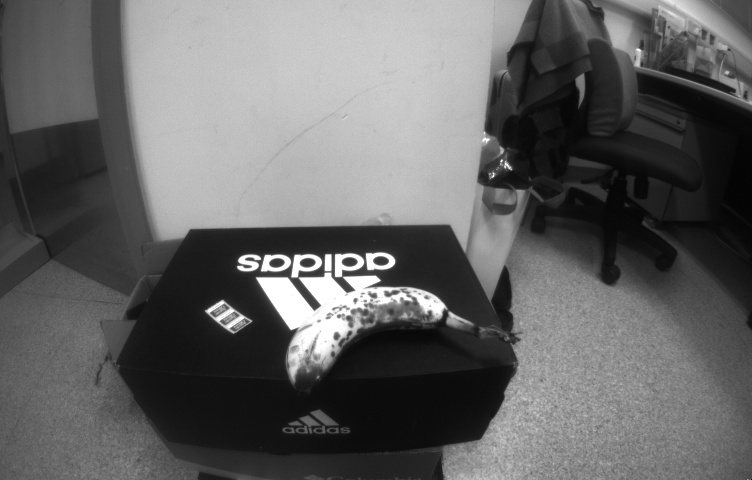

# Align Mesh Model to Image

Trying out a thought.

I take image of a banana. I have a [3d mesh model of a banana](https://free3d.com/3d-model/banana-23586.html).
Since there are semantic alignment methods, it is possible to match points. Once you have
3d-2d correspondence, in principle it should be possible to align the 3d mesh model to the imaged banana.
For now I hard-code the 3d-2d correspondence. See `main.cpp` for the values.

I use [Theia-sfm's DlsPnp method](http://theia-sfm.org/pose.html#perspective-n-point). 

It works!

## How to run?
```
mkdir build
cmake ..
make
./main
```

## Results
### Mesh Model Projected on the Image



### 3d-2d Manually Marked



### Input Image

